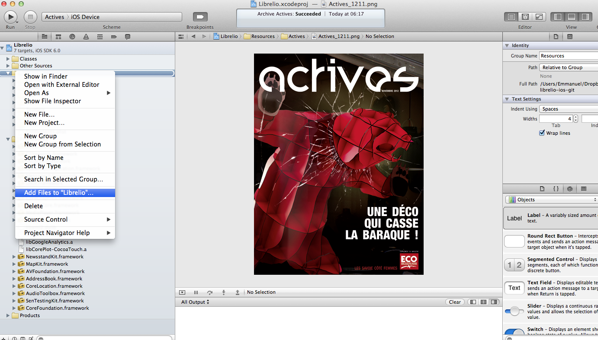
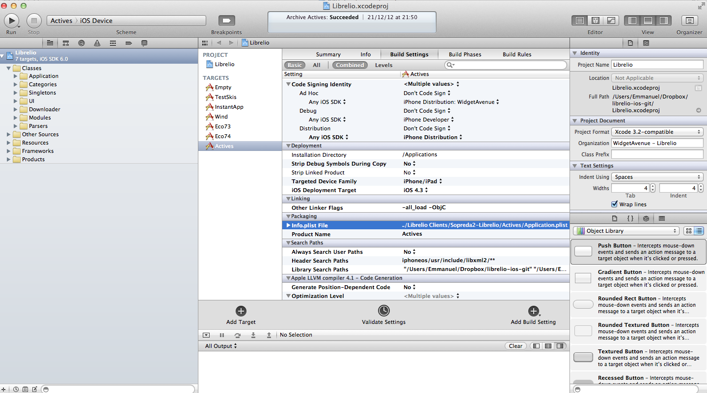
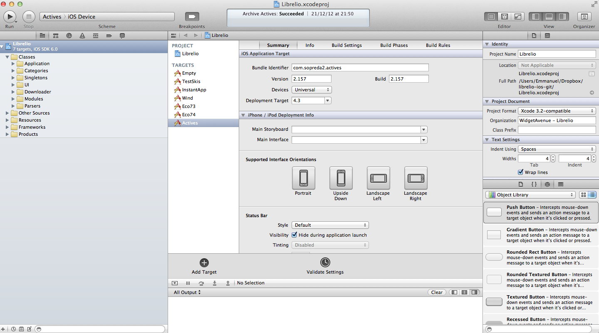

Customization
==

The customization is done by adding a new target. In order to do so:

1- create a directory with all specific resources for the app. This should include a file called application.plist, and specific pngs to be listed later.

2- create a new target by duplicating the "empty" target. The empty target contains all common resources and classes required.

3- add the application resources directory to the new target

4- in the target build settings, under Packaging, change info.plist File, and change Product Name

5- in the target summary, enter the Bundle Identifier for your app 

